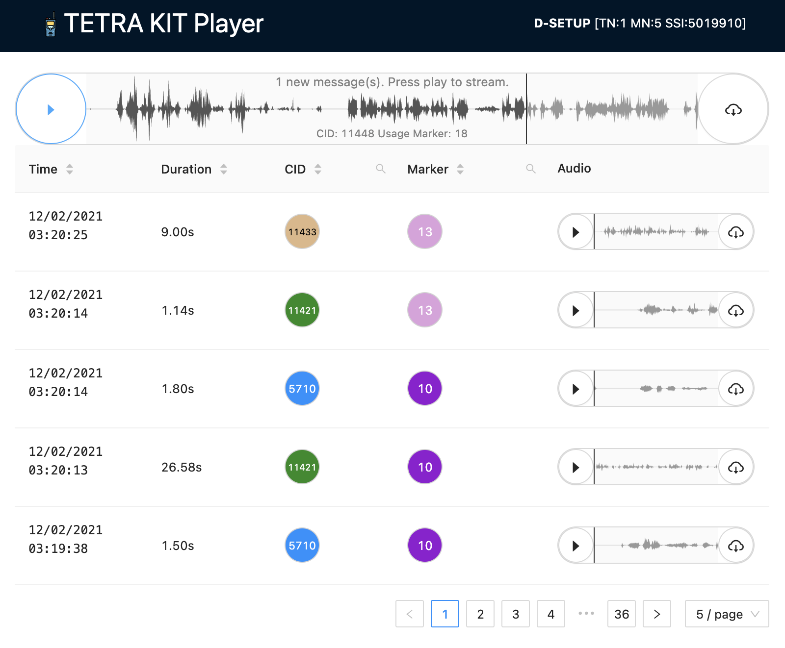

### Tetra Kit Player

TKP is web application that streams events and files produced by [tetra-kit](https://gitlab.com/larryth/tetra-kit/). 

It's like a PVR for tetra-kit. You can pause the live stream re-listen to old messages search, sort, download them.

Also it features small live CMCE indicator (top right).

- Start `decoder` and `recorder -a` from tetra-kit
- Edit `.env` and start the project using: `npm i; npm run start`
